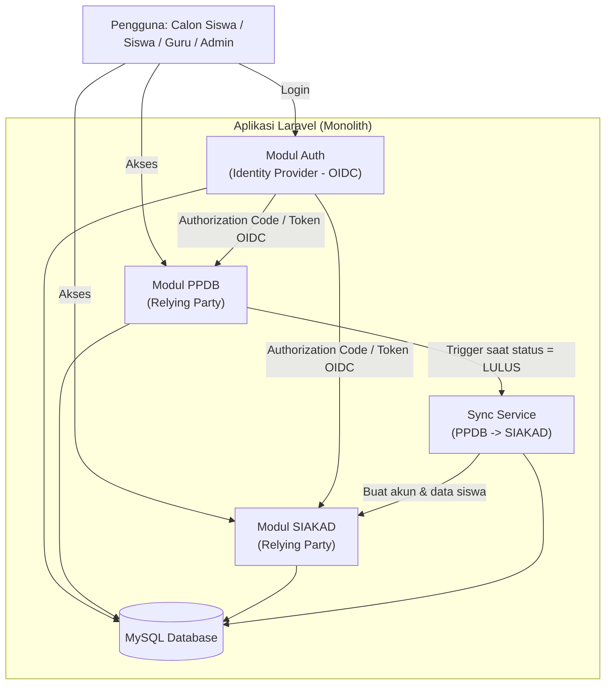
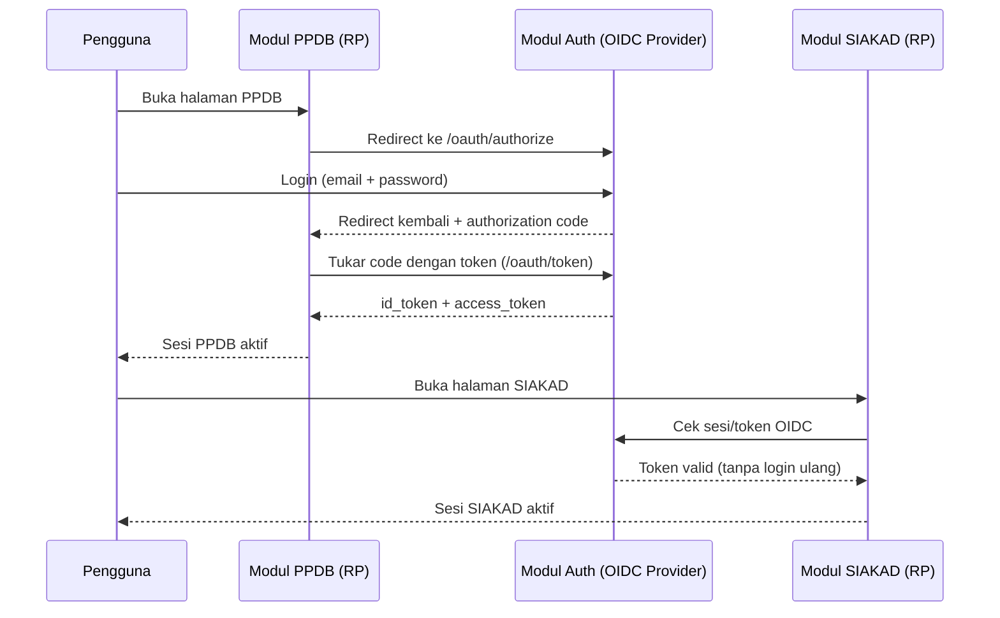
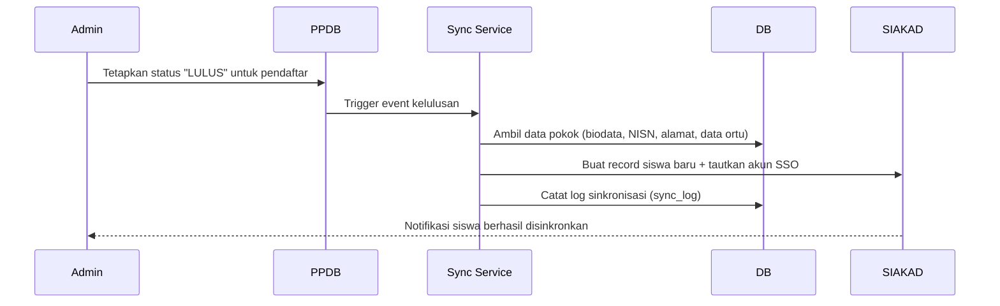
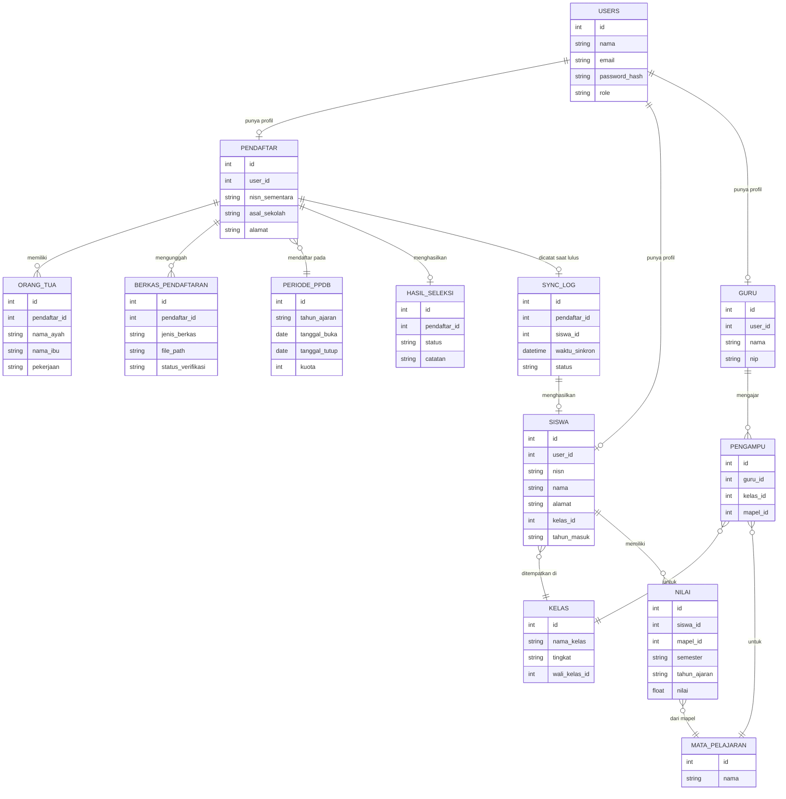

# SRS — Sistem PPDB Terintegrasi SIAKAD dengan SSO (OIDC)
### Studi Kasus: SMAN 1 Terbanggi Besar

**Versi:** 1.0 (Draft)
**Pasangan dokumen:** PRD_PPDB_SIAKAD_SSO.md

---

## 1. Pendahuluan

### 1.1 Tujuan Dokumen
Dokumen ini menjabarkan kebutuhan perangkat lunak secara teknis untuk sistem PPDB yang terintegrasi dengan SIAKAD menggunakan SSO berbasis OpenID Connect (OIDC), sebagai acuan desain dan implementasi.

### 1.2 Ruang Lingkup Produk
Satu aplikasi web berbasis Laravel yang terdiri atas tiga modul logis:
1. **Modul Auth** — Identity Provider (IdP) internal berbasis OIDC
2. **Modul PPDB** — pendaftaran siswa baru (Relying Party terhadap Modul Auth)
3. **Modul SIAKAD** — biodata siswa, pembagian kelas, input nilai (Relying Party terhadap Modul Auth)

### 1.3 Definisi & Akronim

| Istilah | Keterangan |
|---|---|
| PPDB | Penerimaan Peserta Didik Baru |
| SIAKAD | Sistem Informasi Akademik |
| SSO | Single Sign-On |
| OIDC | OpenID Connect — protokol autentikasi di atas OAuth 2.0 |
| IdP | Identity Provider — pihak yang menerbitkan identitas & token |
| RP | Relying Party — aplikasi klien yang mempercayai IdP untuk autentikasi |
| ID Token | Token JWT berisi identitas pengguna, diterbitkan IdP setelah login berhasil |
| NISN | Nomor Induk Siswa Nasional |

### 1.4 Referensi
Proposal skripsi "Pengembangan Sistem Pendaftaran PPDB Terintegrasi Sistem Informasi Akademik (SIAKAD) Menggunakan Teknologi Single Sign-On (SSO)" (Bab I–III).

---

## 2. Deskripsi Umum Sistem

### 2.1 Perspektif Produk
Saat ini PPDB berjalan manual dan SIAKAD belum ada, sehingga kedua modul dibangun baru — bukan migrasi dari sistem lama. Sistem ini menggantikan proses manual sepenuhnya untuk siklus PPDB dan pencatatan biodata/kelas/nilai dasar.

### 2.2 Fungsi Produk (Ringkasan)
- Pendaftaran online, verifikasi berkas, dan pengumuman kelulusan PPDB
- Sinkronisasi otomatis data siswa lulus ke basis data SIAKAD
- Pengelolaan kelas dan input nilai oleh guru
- Autentikasi terpusat satu akun untuk seluruh modul via OIDC

### 2.3 Karakteristik Pengguna

| Aktor | Level Akses |
|---|---|
| Admin/Operator Sekolah | Penuh atas PPDB & SIAKAD, manajemen pengguna |
| Calon Siswa/Siswa | Terbatas pada data dan formulir milik sendiri |
| Guru | Terbatas pada kelas & mata pelajaran yang diampu |

### 2.4 Batasan Sistem
- Modul SIAKAD terbatas pada biodata, pembagian kelas, dan nilai (bukan presensi/jadwal/rapor cetak)
- Data yang disinkronkan otomatis hanya data pokok siswa **yang dinyatakan lulus** (biodata, NISN, alamat, data orang tua)
- Tidak mencakup pengamanan jaringan tingkat lanjut (DDoS/SQL Injection spesifik) maupun pengadaan hardware
- Berlaku khusus untuk SMAN 1 Terbanggi Besar

### 2.5 Asumsi & Ketergantungan
- Kriteria kelulusan PPDB (zonasi/nilai/prestasi/afirmasi) ditetapkan **manual oleh admin** per pendaftar; sistem tidak melakukan skoring otomatis pada v1.
- Satu tahun ajaran = satu periode PPDB dengan kuota tertentu; sistem perlu mendukung data historis multi-tahun (2023–2026 dst.) untuk pelaporan.
- Notifikasi cukup melalui halaman status dalam sistem (belum ada channel email/WhatsApp di v1).
- Sekolah menyediakan data referensi (daftar guru, mata pelajaran, struktur kelas per tingkat) sebelum tahap implementasi.

---

## 3. Arsitektur Sistem

### 3.1 Gambaran Umum
Sistem dibangun sebagai **satu aplikasi Laravel (monolith)**, namun secara logis dipisah menjadi tiga modul agar alur SSO berbasis OIDC tetap terjadi secara nyata antar modul (bukan sekadar shared session), sehingga sesuai dengan Batasan Masalah pada proposal yang secara eksplisit mensyaratkan protokol OIDC.

> **Catatan desain:** Modul Auth berperan sebagai IdP (menerbitkan `authorization code`, `access_token`, `id_token`). Modul PPDB dan SIAKAD masing-masing didaftarkan sebagai **OAuth Client** terpisah di Modul Auth (misalnya menggunakan Laravel Passport sebagai server OAuth2, diperluas untuk mengeluarkan `id_token` bergaya OIDC). Ini memungkinkan pengguna login sekali di salah satu modul dan otomatis terautentikasi di modul lain tanpa login ulang — inti dari SSO.

### 3.2 Alur Autentikasi SSO (OIDC)

### 3.3 Alur Sinkronisasi Data PPDB → SIAKAD

---

## 4. Kebutuhan Fungsional

### 4.1 Modul Auth / SSO

| ID | Deskripsi | Aktor | Prioritas |
|---|---|---|---|
| FR-AUTH-01 | Sistem menyediakan satu titik login (IdP) untuk seluruh modul | Semua | Tinggi |
| FR-AUTH-02 | Sistem menerbitkan authorization code, access token, dan id_token sesuai alur OIDC | Sistem | Tinggi |
| FR-AUTH-03 | Sistem memungkinkan pengguna yang sudah login di satu modul mengakses modul lain tanpa login ulang (SSO) | Semua | Tinggi |
| FR-AUTH-04 | Admin dapat mengelola akun pengguna (buat, nonaktifkan, ubah peran) | Admin | Tinggi |
| FR-AUTH-05 | Sistem membatasi akses fitur berdasarkan peran (role-based access control) | Sistem | Tinggi |
| FR-AUTH-06 | Pengguna dapat logout dan sesi di semua modul ikut berakhir (single logout) | Semua | Sedang |

### 4.2 Modul PPDB

| ID | Deskripsi | Aktor | Prioritas |
|---|---|---|---|
| FR-PPDB-01 | Calon siswa dapat mendaftar akun dan mengisi formulir pendaftaran (biodata, data orang tua) | Calon Siswa | Tinggi |
| FR-PPDB-02 | Calon siswa dapat mengunggah berkas persyaratan (KK, akta lahir, rapor, dll.) | Calon Siswa | Tinggi |
| FR-PPDB-03 | Admin dapat membuka/menutup periode pendaftaran beserta kuota per tahun ajaran | Admin | Tinggi |
| FR-PPDB-04 | Admin dapat memverifikasi kelengkapan berkas pendaftar | Admin | Tinggi |
| FR-PPDB-05 | Admin dapat menetapkan status kelulusan per pendaftar 🔶 **[ASUMSI: manual, bukan skoring otomatis]** | Admin | Tinggi |
| FR-PPDB-06 | Calon siswa dapat melihat status pendaftaran dan pengumuman kelulusan | Calon Siswa | Tinggi |
| FR-PPDB-07 | Sistem menyimpan riwayat pendaftaran per tahun ajaran (data historis) | Sistem | Sedang |

### 4.3 Modul SIAKAD

| ID | Deskripsi | Aktor | Prioritas |
|---|---|---|---|
| FR-SIAKAD-01 | Sistem otomatis membuat data siswa di SIAKAD saat status PPDB = LULUS, tanpa input ulang manual | Sistem | Tinggi |
| FR-SIAKAD-02 | Admin dapat membagi siswa ke dalam kelas | Admin | Tinggi |
| FR-SIAKAD-03 | Admin dapat mengelola data guru dan penugasan guru terhadap kelas/mata pelajaran | Admin | Tinggi |
| FR-SIAKAD-04 | Guru dapat menginput nilai siswa hanya untuk kelas/mapel yang diampu | Guru | Tinggi |
| FR-SIAKAD-05 | Siswa dapat melihat kelasnya dan nilai miliknya sendiri | Siswa | Tinggi |
| FR-SIAKAD-06 | Sistem mencatat log setiap proses sinkronisasi data dari PPDB (untuk audit & pengujian) | Sistem | Sedang |

---

## 5. Kebutuhan Non-Fungsional

| Kategori | Kebutuhan |
|---|---|
| **Kinerja** | Sistem mampu menangani beban pendaftaran hingga ±540 pendaftar per periode tanpa penurunan performa signifikan |
| **Keamanan** | Password di-hash (bcrypt/argon2), komunikasi via HTTPS, token OIDC ditandatangani (JWT signed), percobaan login dibatasi (rate limiting) |
| **Kegunaan (Usability)** | Antarmuka berbahasa Indonesia, responsif untuk diakses dari HP (mayoritas calon siswa mendaftar via ponsel) |
| **Keandalan** | Sistem tersedia stabil selama periode pendaftaran PPDB berlangsung |
| **Pemeliharaan** | Kode mengikuti konvensi Laravel & PSR, terdokumentasi agar mudah dilanjutkan setelah penelitian selesai |
| **Kepatuhan Data Pribadi** | Data pribadi siswa & orang tua disimpan dan diakses sesuai prinsip minimalisasi data dan akses berbasis peran |
| **Portabilitas** | Berjalan baik di browser modern (Chrome, Firefox, Edge) versi terkini |

---

## 6. Model Data (Entitas Utama)

---

## 7. Kebutuhan Antarmuka Eksternal

| Jenis | Kebutuhan |
|---|---|
| Antarmuka Pengguna | Web responsif, berbahasa Indonesia, dapat diakses dari desktop maupun mobile browser |
| Antarmuka Perangkat Lunak | MySQL sebagai basis data; penyimpanan berkas unggahan (local storage atau cloud storage) |
| Antarmuka Komunikasi | HTTPS/TLS untuk seluruh lalu lintas; OIDC (HTTP + JSON/JWT) untuk pertukaran token antar modul |
| Antarmuka Perangkat Keras | Tidak ada kebutuhan khusus (di luar lingkup, sesuai Batasan Masalah proposal) |

---

## 8. Daftar Use Case

| ID | Nama Use Case | Aktor |
|---|---|---|
| UC-01 | Registrasi akun & login (SSO) | Calon Siswa/Siswa, Guru, Admin |
| UC-02 | Mengisi formulir pendaftaran PPDB | Calon Siswa |
| UC-03 | Mengunggah berkas persyaratan | Calon Siswa |
| UC-04 | Mengelola periode & kuota PPDB | Admin |
| UC-05 | Memverifikasi berkas pendaftar | Admin |
| UC-06 | Menetapkan status kelulusan | Admin |
| UC-07 | Melihat pengumuman kelulusan | Calon Siswa |
| UC-08 | Sinkronisasi otomatis data siswa lulus ke SIAKAD | Sistem |
| UC-09 | Mengelola pembagian kelas | Admin |
| UC-10 | Mengelola data guru & penugasan mengajar | Admin |
| UC-11 | Menginput nilai siswa | Guru |
| UC-12 | Melihat kelas & nilai pribadi | Siswa |

*(Use Case Diagram & Activity Diagram bergambar dapat dibuat pada tahap System Design sesuai roadmap di PRD — beri tahu saya kalau ingin langsung dibuatkan sekarang.)*

---

## 9. Strategi Pengujian

Mengikuti metode pengujian pada proposal (Bab III):
- **Black Box Testing** — menguji setiap kebutuhan fungsional (FR-xx) di atas berdasarkan input/output, tanpa melihat kode internal.
- **User Acceptance Test (UAT)** — melibatkan 15 responden (2 operator, 3 guru, 10 siswa) menggunakan sistem secara langsung dan memberi penilaian.
- Fokus pengujian khusus pada: (a) akurasi sinkronisasi data PPDB→SIAKAD, (b) keberhasilan SSO tanpa login ulang antar modul, (c) pembatasan akses sesuai peran.

---

## 10. Asumsi Teknis & Pertanyaan Terbuka

Hal-hal berikut ditandai untuk dikonfirmasi ke pihak sekolah/dosen pembimbing sebelum atau selama implementasi:

1. Kriteria seleksi PPDB — apakah berbasis zonasi, nilai rapor, prestasi, afirmasi, atau kombinasi?
2. Apakah dibutuhkan notifikasi via email/WhatsApp, atau cukup status di dalam sistem?
3. Apakah SIAKAD perlu mendukung multi-tahun ajaran sekaligus (siswa naik kelas), atau cukup untuk angkatan yang sedang berjalan?
4. Format resmi berkas persyaratan PPDB yang berlaku di SMAN 1 Terbanggi Besar (jenis dokumen, ukuran file maksimum, dsb.)

---

## 11. Lampiran

Dokumen ini melengkapi **PRD_PPDB_SIAKAD_SSO.md** dan merujuk pada Bab I–III proposal skripsi yang diunggah.
